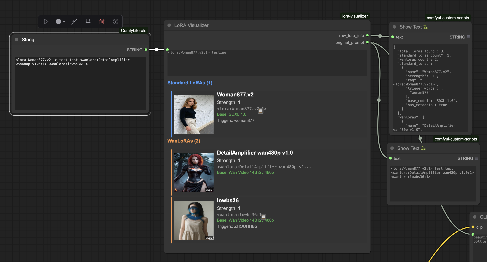
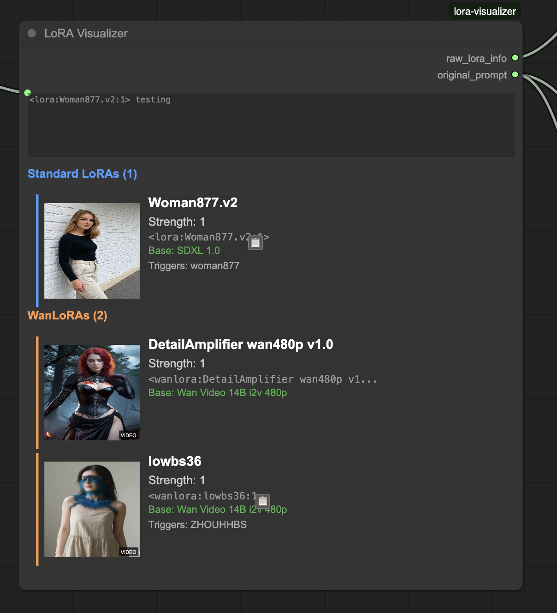
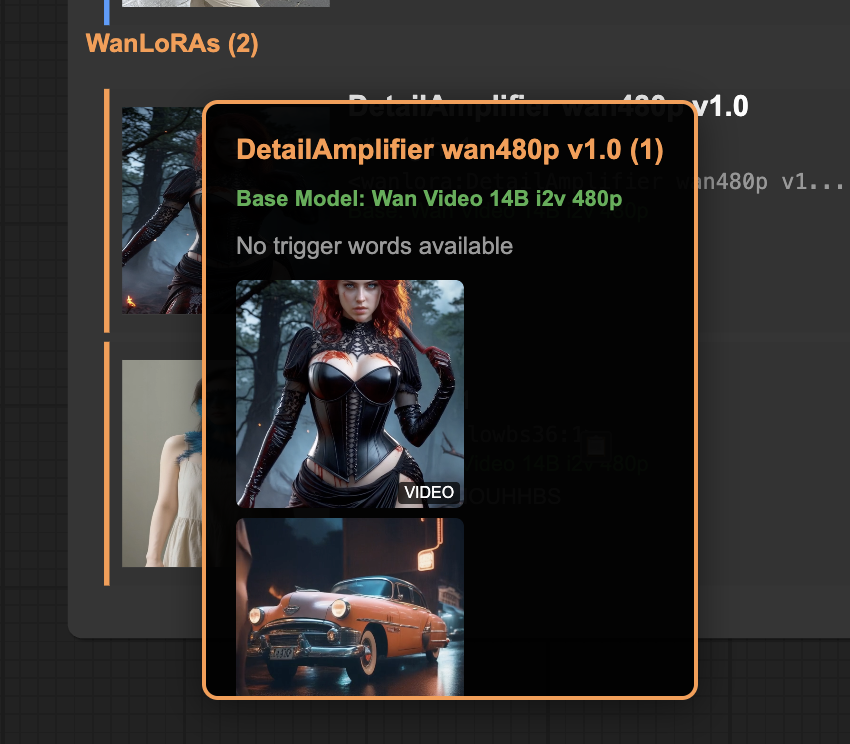
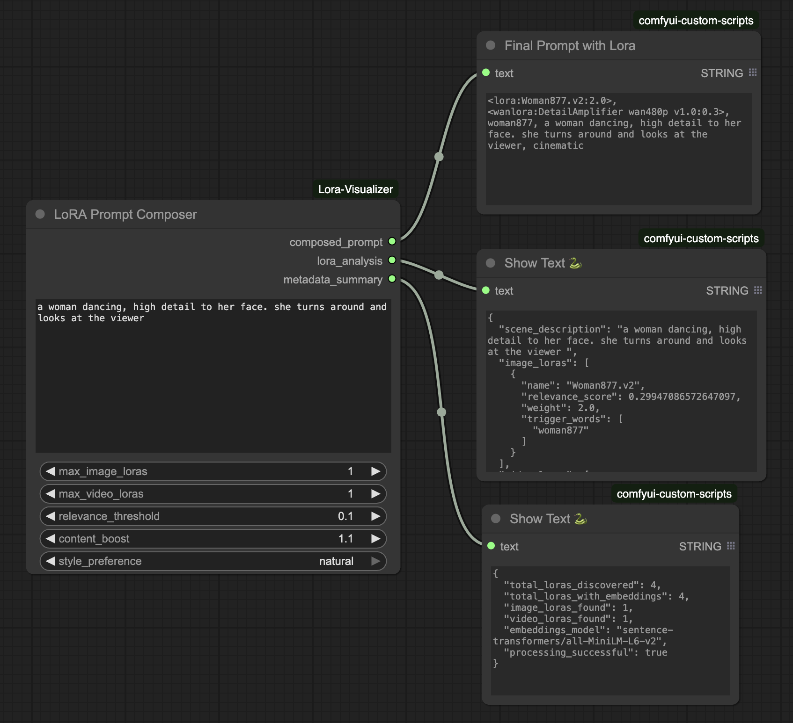
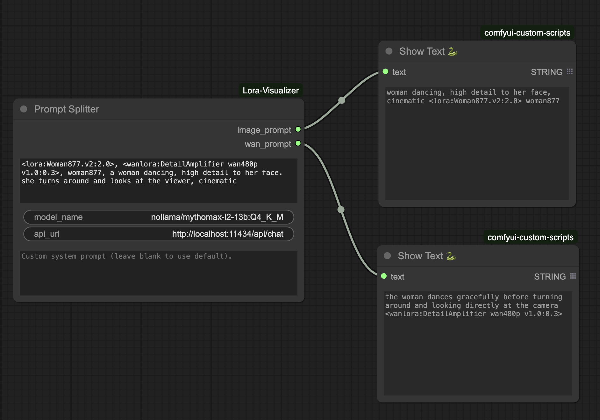
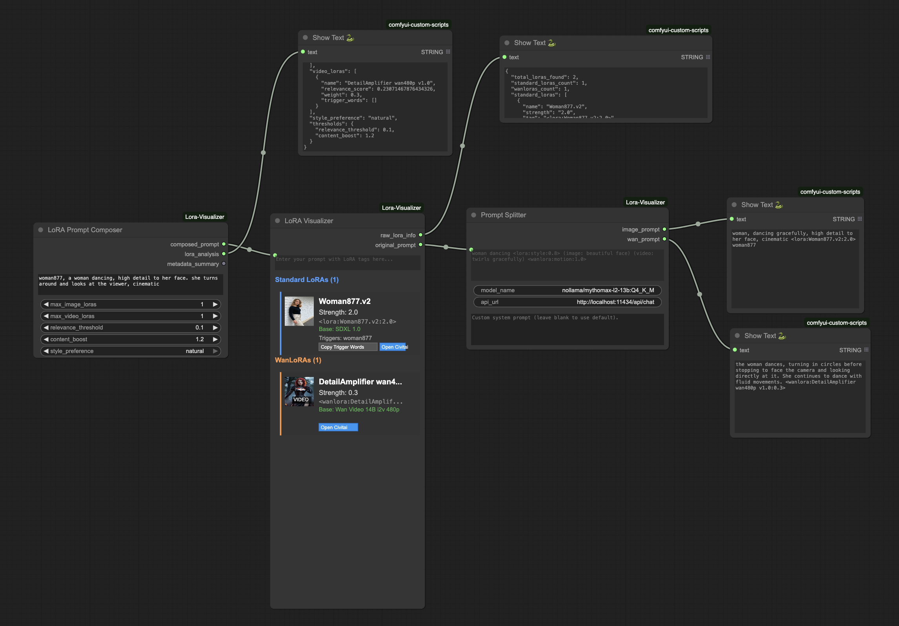

# LoRA Tools Suite - ComfyUI Custom Nodes

A comprehensive ComfyUI custom node package for LoRA management and intelligent prompt composition. Includes three powerful nodes for parsing, visualizing, and composing prompts with LoRA tags.

## 📋 Prerequisites

**Required for all functionality**: Install [ComfyUI-Lora-Manager](https://github.com/willmiao/ComfyUI-Lora-Manager) first. This provides the essential LoRA metadata that powers our visualization and discovery features.

## Included Nodes

### 🔍 LoRA Visualizer
**Parses and visualizes LoRAo tags with rich metadata display**







- **✅ Consistent LoRA Parsing**: Backend Python parsing handles both standard `<lora:name:strength>` and custom `<wanlora:name:strength>` tags with identical logic
- **✅ Complex Name Support**: Handles LoRA names with spaces, colons, and special characters (e.g., `<lora:Detail Enhancer v2.0: Professional Edition:0.8>`)
- **✅ Visual Thumbnails**: Displays actual LoRA preview images loaded from metadata files
- **✅ Metadata Integration**: Shows trigger words, model information, and base model details from ComfyUI LoRA Manager
- **✅ Separate Visual Lists**: Standard LoRAs (blue theme) and WanLoRAs (orange theme) displayed in distinct, color-coded sections
- **✅ Canvas-based Rendering**: Properly integrated with ComfyUI's node system using custom widget drawing
- **✅ Hover Gallery**: Hover over thumbnails to see trigger words and example images

### 🎯 Prompt Composer
**Looks at your installed Wan and SD lora, and intelligently discovers and composes LoRA tags using semantic matching**



- **✅ Semantic LoRA Discovery**: Uses sentence-transformers to find relevant LoRAs based on scene descriptions
- **✅ Natural Language Input**: Describe your scene in plain English, get optimized LoRA suggestions
- **✅ Intelligent Weight Optimization**: Automatically determines optimal LoRA strengths from metadata analysis
- **✅ Content-Aware Matching**: Understands all content types without censorship
- **✅ Image & Video LoRA Support**: Separate limits and handling for image vs video LoRAs
- **✅ Trigger Word Integration**: Automatically includes relevant trigger words in output
- **✅ Style Mimicry**: Learns from example prompts to match artistic styles

NOTE: If you aren't having any lora show up, try to reduce the threshold parameter! This adjusts the semantic matching threshold.

### ✂️ Prompt Splitter (AI-Powered)
**Intelligently splits prompts for image/video workflows using local LLM, while preserving lora/wanlora tags**



- **✅ AI-Powered Analysis**: Uses local Ollama LLM for intelligent prompt processing informed by best prompting practices for SD vs. Wan
- **✅ Dual Output Generation**: Creates separate optimized prompts for image and video generation
- **✅ Content Preservation**: Maintains all descriptive elements while optimizing for each medium
- **✅ Local Processing**: No external API calls, complete privacy
- **✅ Flexible Model Support**: Works with any Ollama-compatible model
- **✅ Structured Output**: Clean, consistent formatting for downstream nodes

## Example: Integration Composer -> Visualizer -> Prompt Splitter



1. Node 1: We generate a new prompt based on the lora installed on our machine using the `LoRA Prompt Composer`, providing it an initial prompt without lora references

2. Node 2: We visualize the `lora` and `wanlora` that were referenced via the `LoRA Visualizer`

3. Node 3: We split that prompt out into a Wan prompt and a SD prompt with the `Prompt Splitter` node. You would then pass these prompts as positive conditioning into SD generation and Wan generation workflows.

## Shared Features

- **✅ Backend-Frontend Architecture**: Python handles parsing and logic, JavaScript handles visualization
- **✅ Comprehensive Testing**: Unit tests cover edge cases and complex name parsing

## Installation

### Option 1: ComfyUI Manager (Recommended)

1. **Install via ComfyUI Manager**: Search for "LoRA Visualizer" in ComfyUI Manager
2. **Restart ComfyUI**: All Python dependencies install automatically
3. **Install external dependencies**: See [Requirements](#requirements--dependencies) section below

### Option 2: Manual Installation

1. **Clone repository** to your ComfyUI `custom_nodes` directory:
   ```bash
   cd ComfyUI/custom_nodes
   git clone https://github.com/oliverswitzer/ComfyUI-Lora-Visualizer.git
   ```

2. **Install Python dependencies** (if not auto-installed):
   ```bash
   cd ComfyUI-Lora-Visualizer
   pip install -r requirements.txt
   ```

3. **Restart ComfyUI** to load the custom node

4. **Install external dependencies**: See [Requirements](#requirements--dependencies) section below

### Post-Installation

The nodes will appear in ComfyUI under:
- **conditioning** → **LoRA Visualizer**
- **conditioning** → **Prompt Composer** 
- **conditioning** → **Prompt Splitter**

## Requirements & Dependencies

### Node Prerequisites Matrix

| Node | LoRA Visualizer | Prompt Composer | Prompt Splitter |
|------|----------------|-----------------|-----------------|
| **External Dependencies** | None | None | Ollama (Local LLM) |
| **Python Dependencies** | None | ✅ sentence-transformers<br/>✅ scikit-learn | None |
| **ComfyUI Dependencies** | ComfyUI LoRA Manager | ComfyUI LoRA Manager | None |
| **Automatic Installation** | ✅ All included | ✅ All included | ✅ All included |

### External Dependencies Setup

#### For Prompt Splitter Node Only

**Ollama Installation** (Required for AI-powered prompt splitting):

1. **Install Ollama**: Download from [ollama.ai](https://ollama.ai)
2. **Install the default model**: Run `ollama pull nollama/mythomax-l2-13b:Q4_K_M`
3. **Verify installation**: Run `ollama list` to see installed models
4. **Start Ollama service**: Ollama runs automatically on most systems

**Supported Ollama Models**:
- `nollama/mythomax-l2-13b:Q4_K_M` (default, ~7GB)
- `llama3.2:3b` (alternative, ~2GB)
- `llama3.2:1b` (lightweight, ~1GB)  
- `qwen2.5:3b` (alternative, ~2GB)
- Any other Ollama-compatible model

#### For LoRA Visualizer & Prompt Composer Nodes

**ComfyUI LoRA Manager** (Required for metadata):
- Install the [ComfyUI LoRA Manager](https://github.com/willmiao/ComfyUI-Lora-Manager) custom node
- Ensures LoRA metadata files are downloaded and maintained
- Required for both visualization and intelligent LoRA discovery features

### Python Dependencies (Auto-Installed)

All Python dependencies are automatically installed when you install this node:

- **sentence-transformers**: For semantic LoRA matching (Prompt Composer)
- **scikit-learn**: For similarity calculations (Prompt Composer)  
- **pytest, black, pylint**: Development tools

**Note**: The node ships with all Python dependencies pre-configured. ComfyUI will automatically install `sentence-transformers` and `scikit-learn` when you first load the Prompt Composer node. No manual Python package installation is required!

## Usage

1. Add the **LoRA Visualizer** node to your workflow
2. Enter a prompt containing LoRA tags in the `prompt_text` input field
3. The node will automatically parse and display information about each LoRA found

### Supported LoRA Tag Formats

- **Standard LoRAs**: `<lora:model_name:strength>`
  - Example: `<lora:landscape_v1:0.8>`
  
- **WanLoRAs**: `<wanlora:model_name:strength>`
  - Example: `<wanlora:Woman877.v2:1.0>`

### Example Prompt

```
A beautiful portrait <lora:realistic_skin:0.7> of <wanlora:Woman877.v2:0.8> woman standing in a garden, highly detailed
```

This will display:
- **Standard LoRAs**: realistic_skin (strength: 0.7)
- **WanLoRAs**: Woman877.v2 (strength: 0.8)


## Output

The node provides two outputs:

1. **lora_info** (STRING): A formatted text report with detailed information about all found LoRAs
2. **processed_prompt** (STRING): The original prompt text (can be modified in future versions)

## Features in Development

- **Image Gallery**: Full implementation of hover-to-view example images
- **Interactive Controls**: Click to copy trigger words, adjust strengths
- **Filtering Options**: Filter by base model, content level, etc.
- **Export Options**: Export LoRA information in various formats

## Testing

Run the test suite to verify functionality:

```bash
./run_tests.sh
```

## File Structure

```
lora-visualizer/
├── __init__.py                     # Node registration
├── README.md                       # This file
├── nodes/
│   └── lora_visualizer_node.py     # Main node implementation
├── web/
│   └── lora_visualizer.js          # Frontend visualization
└── tests/
    └── test_lora_parsing.py        # Unit tests
```

## Contributing

1. Fork the repository
2. Create a feature branch
3. Add tests for new functionality
4. Ensure all tests pass
5. Submit a pull request

## Publishing to ComfyUI Registry

This node can be published to the [ComfyUI Registry](https://registry.comfy.org) for easy installation by users.

### Setup for Publishing

1. **Create a Publisher Account**: Go to [Comfy Registry](https://registry.comfy.org) and create a publisher account
2. **Get Your Publisher ID**: Find your publisher ID (after the `@` symbol) on your profile page
3. **Update pyproject.toml**: Add your Publisher ID to the `PublisherId` field in `pyproject.toml`
4. **Create API Key**: Generate an API key for your publisher in the registry
5. **Set GitHub Secret**: Add your API key as `REGISTRY_ACCESS_TOKEN` in your GitHub repository secrets (Settings → Secrets and Variables → Actions → New Repository Secret)

### Automated Release Workflow

The project uses **conventional commits** for automatic semantic versioning. The **"Release and Publish"** GitHub Action automatically determines the next version based on your commit messages:

#### Commit Message Format:
- `fix: description` → **patch** version bump (1.0.0 → 1.0.1)
- `feat: description` → **minor** version bump (1.0.0 → 1.1.0)
- `BREAKING CHANGE:` in commit body → **major** version bump (1.0.0 → 2.0.0)

#### Release Process:
1. **Make commits** using conventional format
2. **Go to Actions** → "Release and Publish to ComfyUI Registry"
3. **Click "Run workflow"**
4. **Add changelog** (optional)
5. **Choose dry run** to preview without releasing

This workflow automatically:
- ✅ Analyzes commit messages since last release
- ✅ Calculates appropriate version bump
- ✅ Updates version in `pyproject.toml`
- ✅ Creates git tag (e.g., `v1.1.0`)
- ✅ Creates GitHub release with changelog
- ✅ Publishes to ComfyUI Registry

#### Example Commit Messages:
```bash
git commit -m "fix: resolve parsing issue with special characters"
git commit -m "feat: add support for custom LoRA tags"
git commit -m "feat: new visualization mode

BREAKING CHANGE: removes old API methods"
```

### Manual Publishing

For quick republishing without version changes:
1. **Go to Actions** → "Release and Publish to ComfyUI Registry"
2. **Click "Run workflow"**
3. **Select "publish_only"** from the action type dropdown
4. **Click "Run workflow"**

Alternatively, use the ComfyUI CLI: `comfy node publish`

For more details, see the [ComfyUI Registry Publishing Guide](https://docs.comfy.org/registry/publishing).

## 🐛 Debugging and Troubleshooting

### Enable Debug Logging

By default, the LoRA Tools Suite shows only high-level progress messages. For detailed debugging information (similarity scores, boost calculations, metadata processing), enable debug logging:

**Windows (Command Prompt):**
```cmd
set COMFYUI_LORA_DEBUG=1
```

**Windows (PowerShell):**
```powershell
$env:COMFYUI_LORA_DEBUG = "1"
```

**macOS/Linux:**
```bash
export COMFYUI_LORA_DEBUG=1
```

Then start ComfyUI. You'll see detailed debug messages like:
```
[ComfyUI-Lora-Visualizer] Finding relevant image LoRAs...
[ComfyUI-Lora-Visualizer] DEBUG: 🧹 Cleaned scene for embedding: 'cyberpunk woman in neon-lit alley'
[ComfyUI-Lora-Visualizer] DEBUG: 📊 DetailAmplifier similarity: 0.7243
[ComfyUI-Lora-Visualizer] DEBUG: 🚀 DetailAmplifier content boost applied: 0.7243 → 0.8692
[ComfyUI-Lora-Visualizer] Found 3 image LoRAs: ['DetailAmplifier', 'CyberPunkAI', 'NeonStyle']
```

Debug logging helps troubleshoot:
- LoRA discovery and similarity matching
- Keyword boost calculations  
- Prompt composition steps
- Metadata processing details

**To disable:** Remove the environment variable or set it to an empty value.

## Development

### Prerequisites

- [PDM](https://pdm.fming.dev/latest/) for dependency management
- Python 3.8+ (same as ComfyUI requirement)

### Setup Development Environment

1. **Clone the repository**:
   ```bash
   git clone https://github.com/oliverswitzer/ComfyUI-Lora-Visualizer.git
   cd ComfyUI-Lora-Visualizer
   ```

2. **Install development dependencies**:
   ```bash
   pdm install
   ```
   This creates a virtual environment and installs pytest, black, and pylint.

### Running Tests

pdm run test

### Code Quality

**Format code with Black**:
```bash
pdm run format
```

**Lint with Pylint**:
```bash
pdm run lint
```

**Run all checks (format + lint + test)**:
```bash
pdm run check
```

### Test Structure

- **`tests/test_lora_parsing.py`**: Main test suite
- **`tests/fixtures/`**: Sample metadata files for testing
- **`conftest.py`**: Test configuration and ComfyUI mocking

Tests cover:
- LoRA tag parsing (standard and WanLoRA formats)
- Metadata extraction and processing
- Civitai URL generation
- Edge cases and error handling

### Available PDM Scripts

| Command | Description |
|---------|-------------|
| `pdm run format` | Format code with Black |
| `pdm run lint` | Lint code with Pylint |
| `pdm run check` | Run format + lint (tests via ./run_tests.sh) |

Note: For tests, use `./run_tests.sh` due to import complexities with ComfyUI's module structure.

### Adding New Tests

1. Add test methods to `TestLoRAVisualizerNode` class
2. Use fixture files in `tests/fixtures/` for realistic data
3. Mock ComfyUI dependencies (already set up in `conftest.py`)
4. Run tests to ensure everything passes

Example test:
```python
def test_new_feature(self):
    """Test description."""
    # Setup
    test_data = {...}
    
    # Execute
    result = self.node.some_method(test_data)
    
    # Assert
    self.assertEqual(result, expected_value)
```

## License

MIT License - see [LICENSE](LICENSE) file for details.